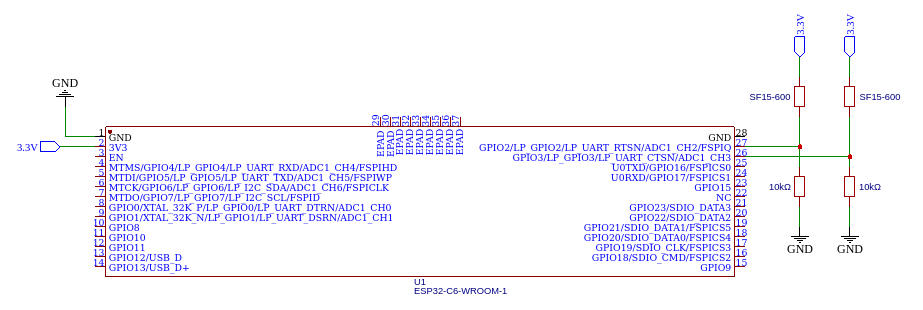
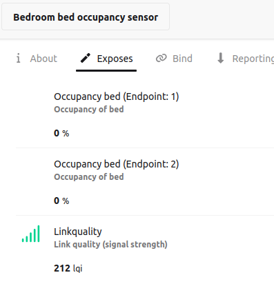

# Bed occupancy sensor with ESP32-C6

Handles bed occupancy on two sides of the bed using two SF15-600 pressure sensors.

Uses ADC channels 2 and 3 to read the voltage and decide whether that side of the bed is occupied.



## Arduino IDE configuration

- Under board manager, install esp32 by Espressif.
- Select the correct board: Tools -> Board.
- Select the End device Zigbee mode: Tools -> Zigbee mode: Zigbee ZCZR
- Select Partition Scheme for Zigbee: Tools -> Partition Scheme: Zigbee 4MB with spiffs
- Select the COM port: Tools -> Port: xxx where the xxx is the detected COM port.

## Zigbee2MQTT configuration

```js
import { deviceEndpoints, numeric } from 'zigbee-herdsman-converters/lib/modernExtend';

export default {
    zigbeeModel: ['Bed occupancy sensor'],
    model: 'Bed occupancy sensor',
    vendor: 'Espressif',
    description: 'Bed occupancy sensors',
    extend: [
      deviceEndpoints({"endpoints":{"1":10,"2":11}}),
      numeric({name: 'occupancy_bed', cluster: 'genAnalogInput', attribute: 'presentValue', unit: '%', description: 'Occupancy of bed', access: 'STATE', endpointNames: ['1', '2'], reporting: { min: "MIN", max: "1_HOUR", change: 0 } }),
    ],
    meta: {"multiEndpoint":true},
};
```
Which shows up as this:

